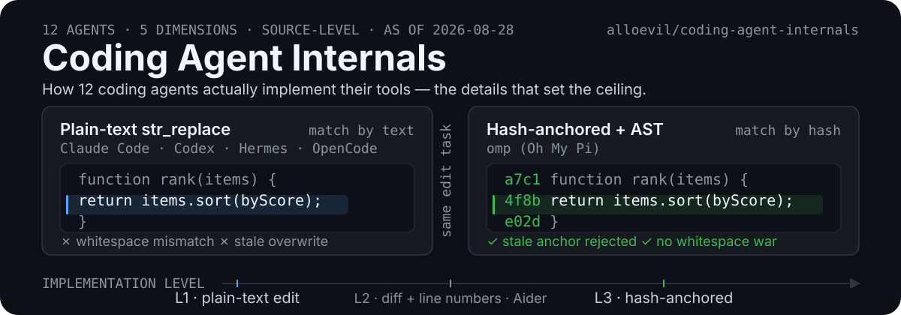

<p align="center">
  
</p>

<p align="center">
  <h1 align="center">🔍 Coding Agent Internals</h1>
  <p align="center"><strong>2026 Deep Comparison / 工具实现深度对比</strong></p>
</p>

**Coding Agent Internals** is a source-code-level comparison catalogue that documents how 12 AI coding agents actually implement their tools — code search, code editing, persistent memory, isolation and sub-agents — for engineers choosing or building a coding-agent harness.

<p align="center">
  
  
  
  
  
</p>

<p align="center">
  <a href="#english">🇺🇸 English</a> · <a href="#中文">🇨🇳 中文</a>
</p>

---

> **EN**: Not feature-list comparisons — deep-dive into **how** each agent's tools are implemented.
> **ZH**: 不是功能列表搬运，而是**工具实现层面**的横向对比。

---

## What it is

Five implementation dimensions — code search, code editing, persistent memory, sandboxing / credential isolation, sub-agents — each get a page that sorts the 12 agents into mechanism levels, and each agent gets a profile page with vendor, form factor, language, licence, pricing and tool implementation. The thesis: these details set the **ceiling** of what a tool can do, so they are worth more than a feature checkbox. Every entry is a dated reading of that agent's source and docs (currently as of 2026-09-12) — agents ship weekly, so treat any single cell as "true when read", not as a permanent property.

这个项目把对比的单位从"宣传的功能"换成"实现方式"：搜索是 fork `rg` 还是进程内引擎、编辑是纯文本替换还是 hash 锚定、有没有持久记忆和凭证隔离。五个维度页 + 12 份 agent 档案，均为带日期的源码级阅读结论（当前截至 2026-09-12）。

## Install

Nothing to install — the catalogue is static pages:

```
https://alloevil.github.io/coding-agent-internals/
```

To read or extend the source Markdown:

```bash
git clone https://github.com/alloevil/coding-agent-internals.git
cd coding-agent-internals
```

The benchmark helpers are plain shell scripts with no build step:

```bash
cd benchmarks
./edit-bench.sh
```

## 🇺🇸 English

### Why This Exists?

Most AI coding agent comparisons are feature checklists. This project focuses on **implementation**:

- **Search**: shell-fork to `rg`, in-process ripgrep, or IDE-native?
- **Edit**: plain-text `str_replace` (whitespace wars), diff+line, or hash-anchored (precise)?
- **Debug**: `print()` statements, or a real DAP debugger wired in?

These details define the **ceiling** of what a tool can do.

---

### 📊 Agents Covered

<table>
<tr>
<td align="center"><a href="agents/claude-code.md"><b>Claude Code</b><br></a></td>
<td align="center"><a href="agents/codex.md"><b>Codex</b><br></a></td>
<td align="center"><a href="agents/omp.md"><b>omp</b><br></a></td>
<td align="center"><a href="agents/hermes.md"><b>Hermes</b><br></a></td>
</tr>
<tr>
<td align="center"><a href="agents/aider.md"><b>Aider</b><br></a></td>
<td align="center"><a href="agents/opencode.md"><b>OpenCode</b><br></a></td>
<td align="center"><a href="agents/gemini-cli.md"><b>Gemini CLI</b><br></a></td>
<td align="center"><a href="agents/copilot-cli.md"><b>Copilot CLI</b><br></a></td>
</tr>
<tr>
<td align="center"><a href="agents/cursor.md"><b>Cursor</b><br></a></td>
<td align="center"><a href="agents/windsurf.md"><b>Windsurf</b><br></a></td>
<td align="center"><a href="agents/cline.md"><b>Cline</b><br></a></td>
<td align="center"><a href="agents/devin.md"><b>Devin</b><br></a></td>
</tr>
</table>

---

### 🔬 Terminal CLI Comparison

| Dim | Claude Code | Codex | omp | Hermes | Aider | OpenCode | Gemini CLI | Copilot CLI |
|-----|------------|-------|-----|--------|-------|----------|-----------|------------|
| Vendor | Anthropic | OpenAI | can1357 | Nous Research | Community | anomalyco | Google | GitHub/MS |
| Language | TS | TS | Rust+TS | Python | Python | TypeScript | TS | — |
| Open Source | ❌ | CLI ✅ | ✅ MIT | ✅ MIT | ✅ Apache | ✅ MIT | ✅ | ❌ |
| Model Lock | Claude only | GPT only | 60+ providers | any OpenAI-compatible | Multi-model | 75+ providers | Gemini only | Multi-model |
| Search | rg shell fork | built-in | **in-process ripgrep** | rg shell fork | rg shell fork | rg shell fork | built-in | built-in |
| Edit | plain text | plain text | **hash-anchored + AST** | plain text | plain text + diff | plain text | plain text | plain text |
| LSP | ❌ | ❌ | ✅ 14 ops | ❌ | ❌ | limited | ❌ | ❌ |
| DAP | ❌ | ❌ | ✅ 28 ops | ❌ | ❌ | ❌ | ❌ | ❌ |
| Sub-agents | ✅ Agent Teams | ✅ cloud parallel | ✅ isolated worktree | ✅ MOA multi-model | ❌ | ✅ limited | ❌ | ✅ Background Agent |
| Memory | ❌ | ❌ | ✅ Hindsight | ✅ built-in + 8 providers | ❌ | ❌ | ❌ | ❌ |
| Cron | ❌ | ❌ | ❌ | ✅ | ❌ | ❌ | ❌ | ❌ |
| Credential isolation | ❌ | cloud sandbox | ❌ | ✅ approval + MCP filtering | ❌ | ❌ | ❌ | ❌ |
| Browser | ✅ Playwright | ❌ | ✅ stealth | ❌ | ❌ | ❌ | ✅ | ❌ |
| MCP | ✅ | ❌ | ✅ | ✅ | ❌ | ✅ | ✅ | ❌ |
| Context | 1M (Opus 4.8) | 400K (Codex) / 1M (API) | model-dependent | model-dependent | model-dependent | model-dependent | model-dependent | model-dependent |
| Benchmark | 88.6% SWE-bench Verified | 82.7% Terminal-Bench 2.0 | — | — | — | — | — | — |
| Price | $20-200/mo | $20-200/mo | free BYO | free BYO | free BYO | free BYO | free tier | $10/mo |

> **Sources for the numbers above.** omp: 60+ providers, 31 built-in tools, 14 LSP ops, 28 DAP ops, ~80k lines of Rust core — [can1357/oh-my-pi README](https://github.com/can1357/oh-my-pi#readme), read 2026-09-12. Claude Code 1M context (Opus 4.8) — [Claude Opus 4.8 model page](https://platform.claude.com/docs/en/models/opus-4-8/overview). Claude 88.6% SWE-bench Verified — [Claude Opus 4.8 System Card](https://www.anthropic.com/claude-opus-4-8-system-card) §8.2 (2026-05-28). Codex 400K context in Codex / 1M on the API, and 82.7% Terminal-Bench 2.0 — [Introducing GPT‑5.5](https://openai.com/index/introducing-gpt-5-5/) (2026-04-23). Hermes: Python, any OpenAI-compatible provider — [NousResearch/hermes-agent README](https://github.com/NousResearch/hermes-agent#readme); memory and credential handling — [Memory](https://hermes-agent.nousresearch.com/docs/user-guide/features/memory) and [Security](https://hermes-agent.nousresearch.com/docs/user-guide/security) docs. OpenCode language — [github.com/anomalyco/opencode](https://github.com/anomalyco/opencode) (GitHub language: TypeScript).

---

### 💡 Key Findings

<details>
<summary><b>🔍 Search: 3 Levels</b></summary>

```
Level 1: shell fork rg/grep     ← Claude Code, Hermes, Aider, OpenCode
Level 2: IDE-native search      ← Cursor, Windsurf, Copilot
Level 3: in-process engine      ← omp (Rust ripgrep — zero fork/exec)
```
</details>

<details>
<summary><b>✏️ Edit: 3 Levels</b></summary>

```
Level 1: plain str_replace      ← most tools
Level 2: diff (search/replace)  ← Aider
Level 3: hash-anchored + AST    ← omp (no whitespace wars, no stale file corruption)
```
</details>

<details>
<summary><b>🧠 Memory: 3 Levels</b></summary>

```
None: fresh each session        ← Claude Code, Codex, Aider, OpenCode
Session-level: project-scoped   ← omp (Hindsight — retain/recall, project isolation)
Provider-based: external store  ← Hermes (built-in MEMORY.md/USER.md + 8 optional providers)
```
</details>

<details>
<summary><b>🔒 Security: 3 Levels</b></summary>

```
No isolation: creds everywhere  ← most local tools
Cloud sandbox: isolated env     ← Codex, Devin
Approval + filtering: 8 layers  ← Hermes (command approval, MCP env isolation, container isolation)
```
</details>

---

### 📁 Deep Dives

| Dimension | File | Core Question |
|-----------|------|---------------|
| 🔍 Search | [dimensions/search.md](dimensions/search.md) | grep vs rg vs in-process? |
| ✏️ Edit | [dimensions/editing.md](dimensions/editing.md) | plain text vs hash vs AST? |
| 🧠 Memory | [dimensions/memory.md](dimensions/memory.md) | none vs session vs external provider? |
| 🔒 Security | [dimensions/security.md](dimensions/security.md) | guard vs sandbox vs none? |
| 🤖 Sub-agents | [dimensions/subagents.md](dimensions/subagents.md) | worktree vs MOA vs cloud? |

---

## 🇨🇳 中文

### 为什么做这个？

市面上的 AI coding agent 对比文章大多是功能清单罗列。但真正影响日常体验的，是工具的**实现方式**：

- 搜索代码时，是 fork 一个 `rg` 子进程，还是进程内直接调用？
- 编辑文件时，是纯文本替换（容易 whitespace 战争），还是 hash 锚定（精确定位）？
- 调试代码时，是靠 `print()` 大法，还是接入了真正的 DAP 调试器？

这些细节决定了工具的**上限**，而不是"能不能用"。

---

### 📊 终端 CLI Agent 对比

| 维度 | Claude Code | Codex | omp | Hermes | Aider | OpenCode | Gemini CLI | Copilot CLI |
|------|------------|-------|-----|--------|-------|----------|-----------|------------|
| 出品方 | Anthropic | OpenAI | can1357 | Nous Research | 开源社区 | anomalyco | Google | GitHub/MS |
| 语言 | TS | TS | Rust+TS | Python | Python | TypeScript | TS | — |
| 开源 | ❌ | CLI ✅ | ✅ MIT | ✅ MIT | ✅ Apache | ✅ MIT | ✅ | ❌ |
| 模型锁定 | 仅 Claude | 仅 GPT | 60+ 提供商 | 任意 OpenAI 兼容 | 多模型 | 75+ 提供商 | 仅 Gemini | 多模型 |
| 搜索实现 | rg shell 调用 | 内置 | **内嵌 ripgrep** | rg shell 调用 | rg shell 调用 | rg shell 调用 | 内置 | 内置 |
| 编辑方式 | 纯文本替换 | 纯文本 | **Hash 锚定 + AST** | 纯文本 | 纯文本 + diff | 纯文本 | 纯文本 | 纯文本 |
| LSP 集成 | ❌ | ❌ | ✅ 14 种操作 | ❌ | ❌ | 有限 | ❌ | ❌ |
| DAP 调试 | ❌ | ❌ | ✅ 28 种操作 | ❌ | ❌ | ❌ | ❌ | ❌ |
| 子代理 | ✅ Agent Teams | ✅ 云端并行 | ✅ 隔离 worktree | ✅ MOA 多模型 | ❌ | ✅ 有限 | ❌ | ✅ Background Agent |
| 持久记忆 | ❌ | ❌ | ✅ Hindsight | ✅ 内置 + 8 个外部提供方 | ❌ | ❌ | ❌ | ❌ |
| 内置 Cron | ❌ | ❌ | ❌ | ✅ | ❌ | ❌ | ❌ | ❌ |
| 凭证隔离 | ❌ | 云端沙箱 | ❌ | ✅ 命令审批 + MCP 凭证过滤 | ❌ | ❌ | ❌ | ❌ |
| 浏览器 | ✅ Playwright | ❌ | ✅ stealth browsing | ❌ | ❌ | ❌ | ✅ | ❌ |
| MCP 协议 | ✅ | ❌ | ✅ | ✅ | ❌ | ✅ | ✅ | ❌ |
| 上下文窗口 | 1M（Opus 4.8） | 400K（Codex）/ 1M（API） | 取决于模型 | 取决于模型 | 取决于模型 | 取决于模型 | 取决于模型 | 取决于模型 |
| 基准测试 | 88.6% SWE-bench Verified | 82.7% Terminal-Bench 2.0 | — | — | — | — | — | — |
| 价格 | $20-200/月 | $20-200/月 | 免费 BYO | 免费 BYO | 免费 BYO | 免费 BYO | 免费额度 | $10/月 |

> **上表数字来源。** omp：60+ 提供商、31 个内置工具、14 种 LSP 操作、28 种 DAP 操作、约 80k 行 Rust 核心 — [can1357/oh-my-pi README](https://github.com/can1357/oh-my-pi#readme)，2026-09-12 读取。Claude Code 1M 上下文（Opus 4.8）— [Claude Opus 4.8 模型页](https://platform.claude.com/docs/en/models/opus-4-8/overview)；88.6% SWE-bench Verified — [Claude Opus 4.8 System Card](https://www.anthropic.com/claude-opus-4-8-system-card) §8.2（2026-05-28）。Codex：Codex 内 400K 上下文 / API 1M，82.7% Terminal-Bench 2.0 — [Introducing GPT‑5.5](https://openai.com/index/introducing-gpt-5-5/)（2026-04-23）。Hermes：Python、任意 OpenAI 兼容提供商 — [NousResearch/hermes-agent README](https://github.com/NousResearch/hermes-agent#readme)；记忆与凭证处理 — [Memory](https://hermes-agent.nousresearch.com/docs/user-guide/features/memory) 与 [Security](https://hermes-agent.nousresearch.com/docs/user-guide/security) 文档。OpenCode 语言 — [github.com/anomalyco/opencode](https://github.com/anomalyco/opencode)（GitHub 语言：TypeScript）。

---

### 💡 核心发现

<details>
<summary><b>🔍 搜索实现的三个层次</b></summary>

```
Level 1: shell 调用 rg/grep    ← Claude Code, Hermes, Aider, OpenCode
Level 2: IDE 原生搜索           ← Cursor, Windsurf, Copilot
Level 3: 进程内嵌引擎           ← omp (Rust ripgrep — 零 fork/exec)
```
</details>

<details>
<summary><b>✏️ 编辑方式的三个层次</b></summary>

```
Level 1: 纯文本 str_replace    ← 大多数工具
Level 2: diff（search/replace） ← Aider
Level 3: hash 锚定 + AST      ← omp（消除 whitespace 战争和 stale file 问题）
```
</details>

<details>
<summary><b>🧠 记忆系统的三个层次</b></summary>

```
无记忆：每次会话从零开始       ← Claude Code, Codex, Aider, OpenCode
会话级记忆：项目内持久化       ← omp (Hindsight Memory — retain/recall，项目级隔离)
外部提供方记忆：跨会话存储     ← Hermes (内置 MEMORY.md/USER.md + 8 个可选外部记忆提供方)
```
</details>

<details>
<summary><b>🔒 安全模型的三个层次</b></summary>

```
无隔离：凭证随处可用           ← 大多数本地工具
云端沙箱：隔离执行环境         ← Codex, Devin
审批 + 过滤：8 层安全模型      ← Hermes（命令审批、MCP 环境变量隔离、容器隔离）
```
</details>

---

### 📁 深度对比

| 维度 | 文件 | 核心问题 |
|------|------|---------|
| 🔍 代码搜索 | [dimensions/search.md](dimensions/search.md) | grep vs rg vs 内嵌引擎？ |
| ✏️ 代码编辑 | [dimensions/editing.md](dimensions/editing.md) | 纯文本 vs hash vs AST？ |
| 🧠 持久记忆 | [dimensions/memory.md](dimensions/memory.md) | 外部提供方 vs 无 vs 上下文压缩？ |
| 🔒 安全隔离 | [dimensions/security.md](dimensions/security.md) | 凭证隔离 vs 沙箱 vs 无？ |
| 🤖 子代理 | [dimensions/subagents.md](dimensions/subagents.md) | worktree vs MOA vs 云端沙箱？ |

---

## When to use it

- You are choosing a coding agent and want to know **why** one fails at edits another applies cleanly, rather than which one has more checkboxes.
- You are building an agent harness and want a survey of the mechanisms in use, and the trade-offs each choice locks in.
- You need per-agent facts (vendor, licence, language, form factor, pricing tier) collected in one place with links onward.

## When NOT to use it

- **You want performance numbers.** There are none measured here — the only figures on the pages are vendor-published ones, each with its source URL. `benchmarks/` ships runnable scripts and a methodology, but its result tables are labelled *expected* (预期结果) — hypotheses, not measurements. Nothing has been run and published, and for that reason this repo publishes no `claims.json`.
- **You want a ranking or a "best agent" verdict.** The catalogue sorts implementations into levels and names the trade-offs; it does not score agents overall.
- **You need guaranteed-current information.** Every entry is a dated reading (as of 2026-09-12). Agents ship weekly — verify any cell your decision actually hinges on against the vendor's current docs.
- **You need pricing you can budget against.** Price rows are indicative tiers as observed, not quotes.
- **You want coverage of non-coding agents** or general IDE autocomplete products. Scope is coding agents with a tool layer.

## FAQ

**Which agents are covered?**
Twelve: Claude Code (Anthropic), Codex (OpenAI), omp / Oh My Pi (can1357), Hermes Agent (Nous Research), Aider (community), OpenCode (anomalyco), Gemini CLI (Google), GitHub Copilot CLI (GitHub/Microsoft), Cursor (Anysphere), Windsurf (Cognition), Cline (community), Devin (Cognition). The first eight are terminal CLIs and appear in the main matrix; the other four are IDEs, an editor extension and a hosted platform, so they appear in the profiles and dimension pages instead.

**Does this project benchmark the agents?**
No. It publishes no measured numbers of its own. `benchmarks/` contains runnable search and edit test cases plus controls (same hardware, same repo commit, three runs taking the median, public scripts) and tables of *expected* results for them. The only performance figures anywhere in the catalogue are vendor-published numbers, each labelled with its source URL; none of them are measured by this project.

**Why does hash-anchored editing beat plain-text replacement?**
Plain-text replacement locates the edit by a string the model reproduces from memory, so it fails on indentation mismatch, silently overwrites when the file changed after the model read it, and can hit the wrong occurrence when the string is not unique. A hash anchor is issued by the tool, so a stale or ambiguous anchor is rejected instead of mis-applied; AST awareness lets the tool address a whole construct instead of a text span. The cost is complexity in the tool layer and a format the model must be prompted or trained into.

**How do I cite a finding?**
Cite the specific page, not the site root — the dimension and agent pages are the units that carry the claim, e.g. `https://alloevil.github.io/coding-agent-internals/dimensions/editing.html` or `https://alloevil.github.io/coding-agent-internals/agents/omp.html`. The repository is MIT licensed.

**How do I correct something?**
Open a PR with source-code evidence for the changed cell (see `CONTRIBUTING.md`). Stale entries are corrected rather than accumulated, and the "Last Updated" badge plus the as-of date move with them.

---

## 🤝 Contributing / 贡献

Contributions welcome! / 欢迎贡献！

- **Implementation details** with source-code evidence / 有源码级证据的实现细节
- **Reproducible benchmarks** / 可复现的 benchmark 数据
- **New agents** / 新发布的 agent 信息

---

## 📄 License

MIT

---

<p align="center">
  <b>Keywords</b>: AI coding agent, Claude Code, Codex, omp, oh-my-pi, Hermes Agent, Aider, OpenCode, Gemini CLI, Copilot CLI, Cursor, Windsurf, Cline, Devin, tool implementation, ripgrep, LSP, DAP, hash-anchored edits, 2026
</p>

---

<p align="center">
  <a href="https://github.com/oil-oil/beautify-github-readme"></a>
</p>
